# core-v-mcu-cli-test
Eclipse/FreeRTOS/core-v-mcu example program

### Installation
Eclipse relies on a larger ecosystem of tools.  This project uses a particualr set of tools in a particualr set of locations.  These instructions do not cover loading the other tools, or adapting the preferences to point to different tools or different locations.  These instructions assume that you are familar enough with Eclispe to make any required changes.
### Step 1: 
Download and install Eclipse for Embedded and not Host based eclipse.  
~~~
https://projects.eclipse.org/projects/iot.embed-cdt/downloads
~~~

### Step 2:
Install OpenOCD.  Recommend getting it from this location:
~~~
https://sourceforge.net/projects/openocd/files/openocd/
~~~
I used 0.11.0-rc2.

Installation is accomplished by:
~~~
./configure && make
sudo make install
~~~ 

### Step 3: run Eclipse, import projects directly from git (import launch in step 4)

NOTE: importing the cli_test does not imprt the information to launch the debugger, so after importing cli_test, be sure to either import the launch configuration or create your own.

1 Launch Eclipse
~~~
eclipse
~~~
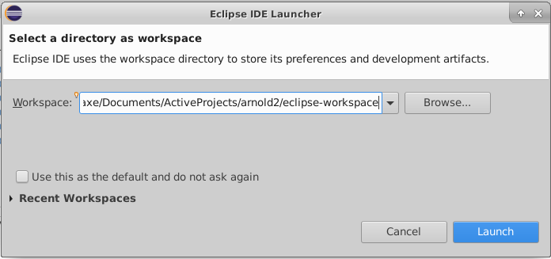

2 From Welcome, select Import
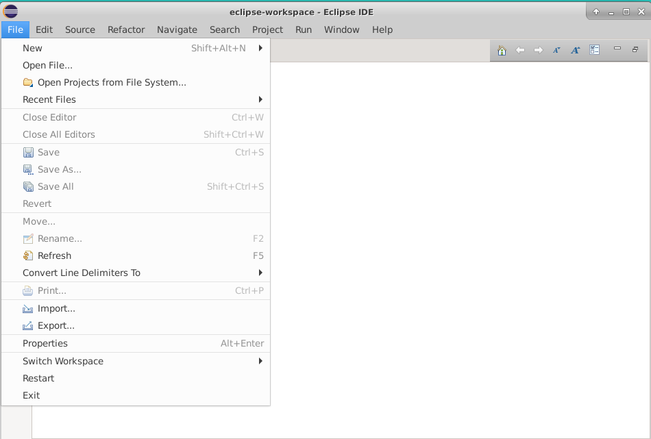

3 Select Import Projects from Git

4 Specify Clone URL

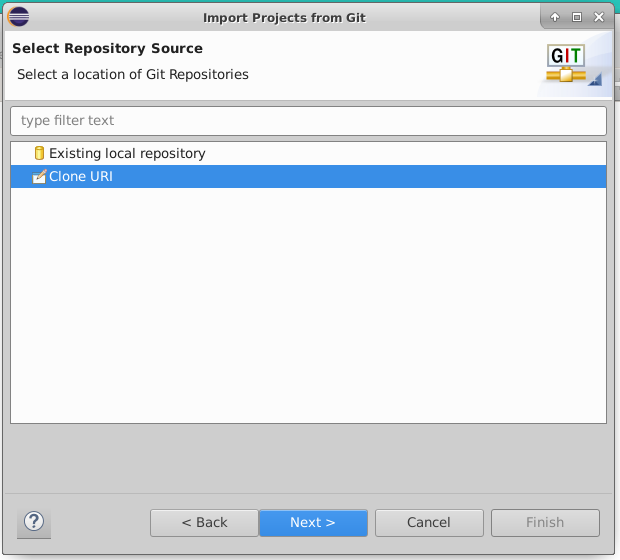

5 Tell Git which repo to use (core-v-mcu-eclipse-cli-test)

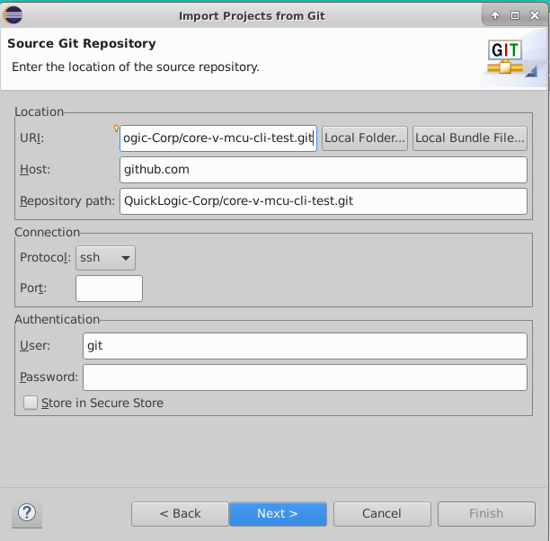

6 Select the branch to clone

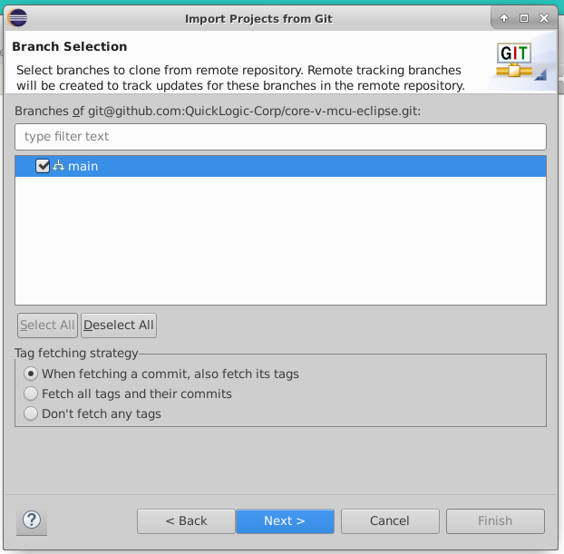

7 Specify directory for git to use (I use the default)

8 Select which Wizard to use for import

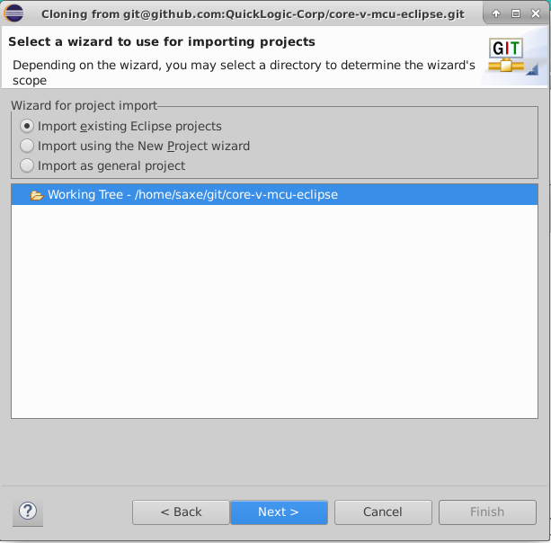

9 Tell it which projects to import (cli_test is the only one you need)

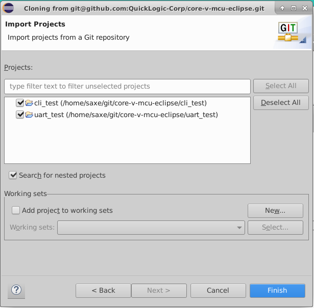

10 What you should see after slected 'Finish'

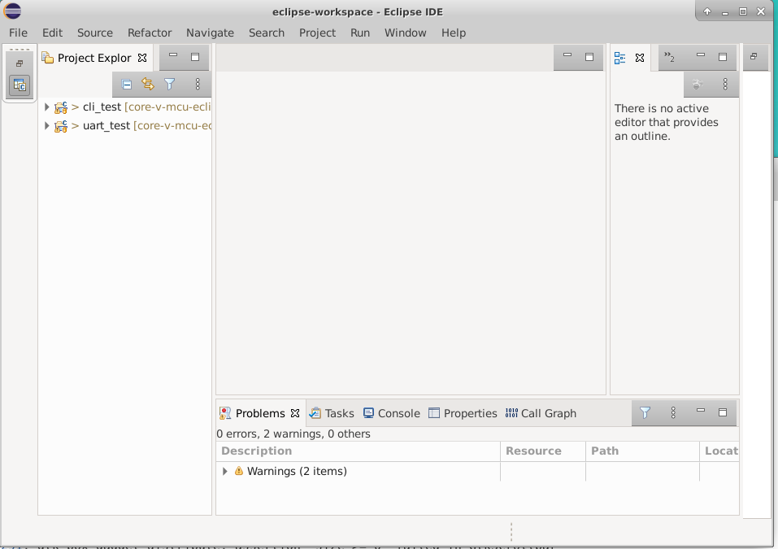

# Step 4: Import launch configuration
This step pulls in the launch configurations which are configured to use hs2 and OpenOCD.
If your hardware setup is different, you can either ignore this step and create your own, or use this step and modify to fit your configuration.

1 Select 'Import...'

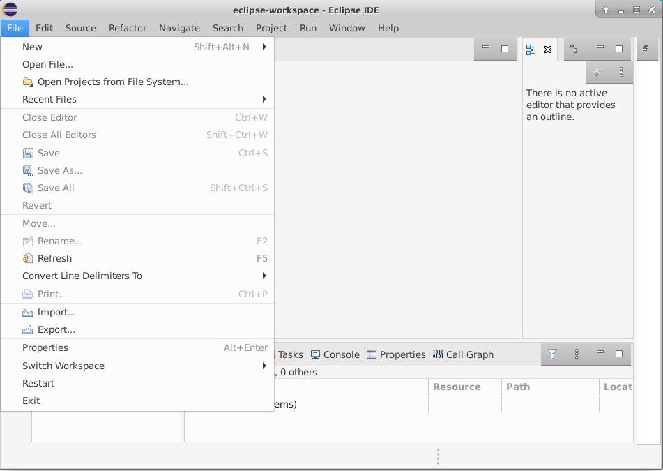

2 Select Launch Configurations

13 Browse to the git directory that was chosen as the Local Destination

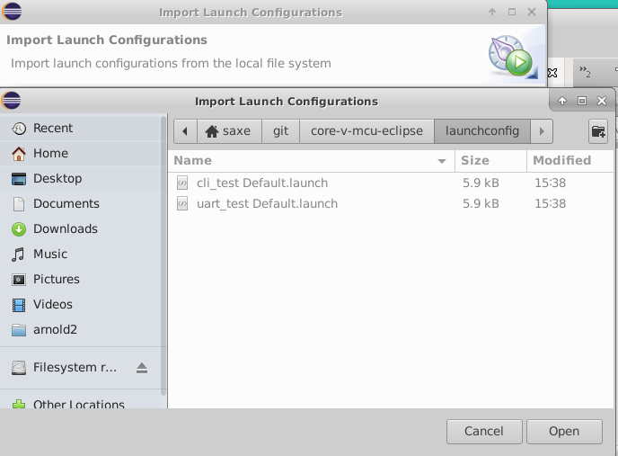

14 Select launchconfig and cli_test Default

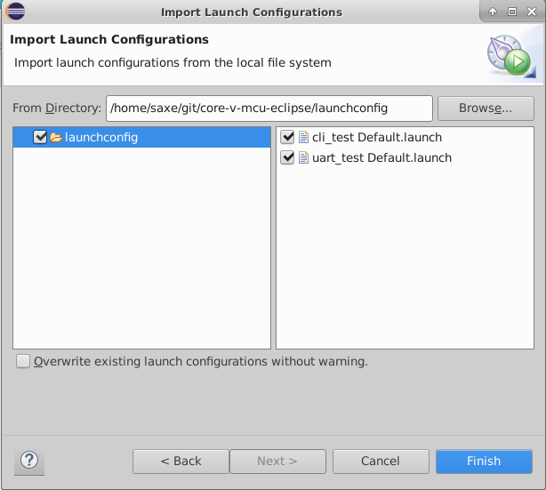

15 Under the 'Run' menu select 'Debug Configurations...'

15 Under 'GDB OpenOCD Debugging'  select 'cli_test Default' and then 'Debug'

This should compile, link and load the application and stop at main waiting for you to start debugging.

## Emulation hardware
The intent is to support more than one emulation platform.
Currently only one board is supported:

* Nexys A7 100T

## Emulation bitsream
Bistreams compatible with the Nexys A7 100T can be found at:
http://quickai.quicklogic.com/
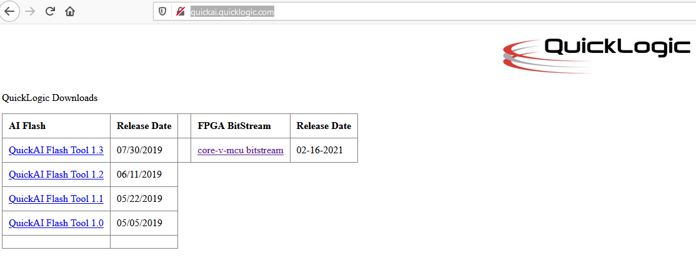

TODO: need to move bitstreams to an Open Hardware URL.

## Peripheral support
The type and number of peripherals supported are defined by 'pulp_soc_defines.sv'.
The information is made available to software applications as a series of #define values in the 'SOC options' section of 'target/core-v-mcu/include/core-v-mcu-config.h'.
An example configuration is:
~~~
// SOC options
#define N_IO                 48         // Total available IO
#define N_SYSIO              3
#define N_GPIO               32
#define N_UART               2          // Number of uarts
#define N_QSPIM              1          // Number of QuadSPI masters
#define N_I2CM               2          // Number of I2C masters
#define N_I2SC               0
#define N_CSI2               0
#define N_HYPER              0
#define N_SDIO               0
#define N_CAM                1
#define N_JTAG               0
#define N_MRAM               0
#define N_FILTER             1
#define N_FPGA               1
#define N_EXT_PER            0
#define N_EFPGA_TCDM_PORTS   4
#define N_FPGAIO             43
#define N_EFPGA_EVENTS       16
~~~